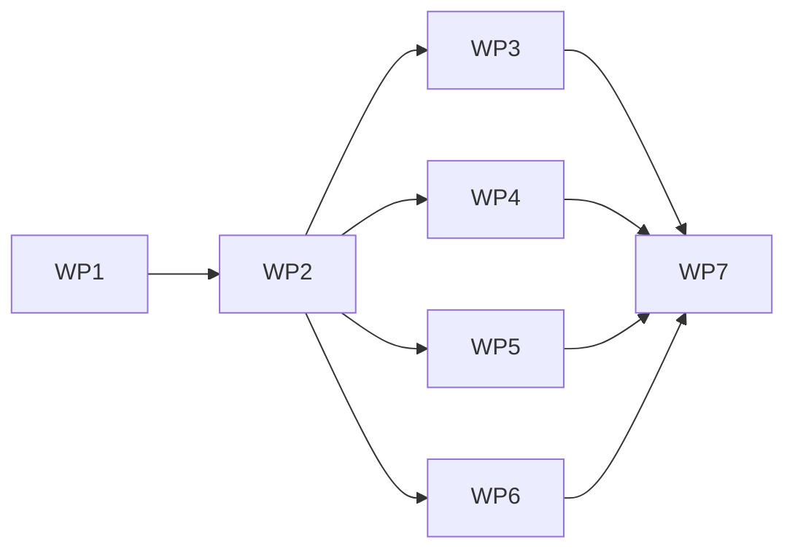

# Plan-0003: M5 — WASI-Runtime-Adapter (Out-of-Process) und Connector-SDK

- **Status:** Entwurf
- **Datum:** 2026-07-24
- **Autor:** Senior-Tech-Specialist (Claude)
- **Basis-PRD:** Standalone — gegründet auf [ADR-0020](../adr/0020-wasi-runtime-out-of-process-rust-host.md), Roadmap `docs/prompts/claude-hardening-and-protocol-roadmap.md` (M5)
- **Verantwortlich:** Product Owner

## Kontext / Motivation

M4 hat das WASI-Sicherheitsmodell in einem Rust/Wasmtime-47-Spike belegt (Grant-Modell default-deny, Ed25519-Publisher-Signatur + Pinning, Grant-Audit, echtes deny-before-instantiation). M5 macht daraus einen produktionsfähigen Ausführungspfad. [ADR-0020](../adr/0020-wasi-runtime-out-of-process-rust-host.md) legt die Architektur fest: Da `wasmtime-dotnet` kein Component Model/WASI-P2 kann, läuft die Runtime als **eigenständiger Rust-Host-Prozess**, den das .NET-Gateway über einen **versionierten lokalen IPC-Vertrag** ansteuert — jeder Aufruf bleibt im bestehenden `IToolInvoker`-Governance-Pfad, kein Bypass.

## Ziele

- Ein signiertes WASI-P2-Component erscheint als normaler Upstream im Katalog und ist über MCP **und** REST aufrufbar — durch die volle Governance-Pipeline (RBAC → Guardrail → Approval → Rate-Limit → Audit).
- Feingranulare, default-deny Grants (per-Preopen/-Socket/-Env/-Secret) im Host durchgesetzt.
- Publisher-Signatur gegen einen **persistierten** Trust-Store beim Laden geprüft; Grant-Audit im bestehenden Audit-Pfad.
- Host-Prozess unter Supervisor (Start/Restart/Kill), Win+Linux, non-root; CI grün auf beiden.
- Kein Governance-Bypass; der Host nutzt nie direkt DB/Stores.

## Arbeitspakete (Workstreams)

### WP1: IPC-Vertrag + Rust-Host-Binary

**Zweck:** Der M4-Spike wird ein langlebiger Host-Prozess mit einem versionierten Kommando-Vertrag.
**Rolle:** Rust/Runtime.
**Schätzung:** L

**Schritte:**
1. **WP1.1:** IPC-Form entscheiden (length-prefixed JSON über stdio vs. lokaler Socket) — Mini-Entscheidung, ggf. ADR-0021. Kriterium: robust, killbar, Win+Linux, ein Prozess pro Gateway.
2. **WP1.2:** Handshake mit Versionsfeld (`hello`/`capabilities`) — .NET und Host lehnen inkompatible Versionen ab.
3. **WP1.3:** Kommandos: `load(component-bytes|ref, signature, grants)` → verify + instantiate, `discover` → Tools, `invoke(tool, args)` → result, `health`, `shutdown`. Strukturierte Fehler + Truncation-Metadaten.
4. **WP1.4:** Limits (Fuel/Epoch/Memory/Output) + Prozess-/Aufruf-Timeouts pro `invoke`.
5. **WP1.5:** Property-/Fuzz-Tests auf das Framing (partielle Reads, große/Binär-Payloads); CI Win+Linux.

**Ergebnis:** Ein `mcpmcp-wasi-host`-Binary, das den Vertrag spricht; Vertrag als versioniertes Schema dokumentiert.

### WP2: .NET WasiRuntimeConnector

**Zweck:** Neuer Upstream-Transport `Kind=Wasi`, der den Host startet/überwacht und den Vertrag spricht.
**Rolle:** .NET/Core.
**Schätzung:** L

**Schritte:**
1. **WP2.1:** `UpstreamTransportKind.Wasi` + `WasiTransportOptions` (Host-Pfad, Component-Quelle, Grants, Limits) + Validator-Case.
2. **WP2.2:** `WasiRuntimeConnector : IUpstreamConnector` + `IUpstreamConnection` — Host über den bestehenden Supervisor-/ProcessHygiene-Weg (ADR-0005) starten, IPC-Client, `DiscoverAsync`/`CallToolAsync` auf den Vertrag mappen.
3. **WP2.3:** DI-Registrierung; erscheint im aggregierten Katalog und in der REST-/OpenAPI-Fassade.
4. **WP2.4:** Integrationstest: ein signiertes Component wird über den vollen `IToolInvoker` aufgerufen (RBAC/Guardrail/Approval/Audit nachgewiesen).

**Ergebnis:** WASI-Tools sind über MCP + REST bedienbar, ununterscheidbar von anderen Upstreams.

### WP3: Feingranulares Grant-Mapping im Host

**Zweck:** Grants real per-Ressource an den WASI-Host binden statt world-level.
**Rolle:** Rust/Runtime.
**Schätzung:** M

**Schritte:**
1. **WP3.1:** `CapabilityGrants` → `wasmtime-wasi` per-Interface: Preopens (nur gewährte, kanonische Roots), Netzwerk-Allowlist, Environment-Keys, Secret-Injection.
2. **WP3.2:** Negativtests je Kategorie erweitern (nicht gewährt → deny; Traversal/Symlink am realen Preopen).

**Ergebnis:** Grant-Gating auf Ressourcen-Ebene, default-deny, belegt.

### WP4: Publisher-Trust-Store + Signatur beim Laden

**Zweck:** Administrativ verwaltete, persistierte Publisher-Keys; Signaturprüfung im Ladepfad; Grant-Audit.
**Rolle:** .NET/Persistence + Rust.
**Schätzung:** M

**Schritte:**
1. **WP4.1:** Trust-Store (EF/DataProtection, NFR-04): Publisher-Public-Keys anlegen/pinnen/entziehen; UI/REST-Verwaltung.
2. **WP4.2:** Beim `load` prüft der Host die Signatur gegen die übergebenen gepinnten Keys; Abweisung fail-closed.
3. **WP4.3:** Grant-Audit-Datensatz (Modulhash/Publisher/Runtime/Grants) in den bestehenden Audit-Pfad.

**Ergebnis:** Nur signierte, gepinnte Components laufen; jeder Load ist auditiert.

### WP5: Modul-Cache + Rollback

**Zweck:** Kompilierte Components content-addressed cachen; sicher zurückrollen.
**Rolle:** Rust/Runtime.
**Schätzung:** M

**Schritte:**
1. **WP5.1:** Cache-Key = Hash + Runtime-Version + Grant-Version; Cache-Invalidierung bei Änderung.
2. **WP5.2:** Rollback auf die vorige Version bei fehlgeschlagenem Load/Health; Messung der Startup-/Compile-Kosten.

**Ergebnis:** Warme Starts, deterministische Invalidierung, Rollback bei Fehler.

### WP6: Connector-SDK / Handshake (ADR-0016)

**Zweck:** Den IPC-Vertrag als versionierten Connector-Vertrag formalisieren.
**Rolle:** .NET + Rust.
**Schätzung:** L

**Schritte:**
1. **WP6.1:** Vertrag entlang ADR-0016 schärfen: Discovery, Schema-Normalisierung, Invoke, Cancellation, Health/Readiness, Lifecycle, Capability-Flags, Fehlersemantik, Kompatibilitätsprüfung.
2. **WP6.2:** Kompatibilitätstests (.NET ↔ Host, ältere/neuere Vertragsversion) in CI.

**Ergebnis:** Der WASI-Host ist der erste Connector nach dem stabilen Vertrag — Basis für Drittanbieter-Connectoren.

### WP7: Packaging, CI, Security-Review

**Zweck:** Rust-Host neben dem .NET-Image ausliefern, auf beiden OS, mit Sicherheitsnachweis.
**Rolle:** DevOps/Security.
**Schätzung:** L

**Schritte:**
1. **WP7.1:** Cross-Platform-Build des Hosts (statisch wo möglich); ein Container mit .NET + Host **oder** getrennte Artefakte entscheiden.
2. **WP7.2:** CI-Matrix Win+Linux für Host + Integrationstests; non-root im Image.
3. **WP7.3:** Security-Review des neuen Pfades (IPC-Fläche, Signaturkette, Grant-Durchsetzung); DoD-Abgleich.
4. **WP7.4:** ADR-0017 auf Basis der Belege neu bewerten (Vorgeschlagen → Akzeptiert oder begründet weiter offen).

**Ergebnis:** Deploybarer WASI-Pluginpfad, extern belegt; ADR-0017 entschieden.

## Abhängigkeiten

| Von | Nach | Typ |
|-----|------|-----|
| WP1 fertig | WP2 Start | intern, blocking |
| WP1 + WP2 fertig | WP3 Start | intern |
| WP2 fertig | WP4, WP5 Start | intern |
| WP1 + WP2 fertig | WP6 Start | intern |
| WP1–WP6 fertig | WP7 Start | intern, blocking |

WP3/WP4/WP5 laufen nach WP2 weitgehend parallel — der kritische Pfad ist WP1 → WP2 → WP6 → WP7.

## Risiken & Mitigationen

| # | Risiko | Wahrscheinlichkeit | Impact | Mitigation |
|---|--------|---------------------|--------|------------|
| R1 | Cross-Platform-Rust-Build/Packaging (Win+Linux, statisch vs. dynamisch, Container) | mittel | hoch | Schon in WP1.5 einen minimalen Cross-Build + CI-Matrix aufsetzen; Host statisch linken, wo möglich; früh im Ziel-Container testen |
| R2 | IPC-Robustheit (Framing, Deadlocks, partielle Reads, große/Binär-Payloads) | mittel | hoch | Length-prefixed Framing + Property-/Fuzz-Tests (WP1.5); Timeouts/Cancel; Binärdaten als begrenzte Blobs/Artifact-Ref |
| R3 | Host-Prozess-Lifecycle (Start/Restart/Orphan/Shutdown) | mittel | mittel | Bestehende Supervisor-/ProcessHygiene-Muster (ADR-0005) wiederverwenden; `health` im Vertrag; Shutdown-Test |
| R4 | Startup-/Compile-Latenz pro Aufruf | mittel | mittel | Langlebiger Host + Modul-Cache (WP5); Latenz früh messen (M1) |
| R5 | Vertrags-Versionen (.NET ↔ Rust) laufen auseinander | mittel | mittel | Expliziter Versions-Handshake (WP1.2/WP6); Kompatibilitätstests in CI |
| R6 | Governance-Bypass-Regression (neuer Pfad umgeht Guardrail/Approval) | niedrig | hoch | Connector geht durch denselben `IToolInvoker`; Integrationstest, der Guardrail/Approval auf einem WASI-Tool nachweist (WP2.4) |
| R7 | Solo-Kapazität — M5 ist groß, XL-Gefahr | hoch | mittel | Strikte WP-Reihenfolge; jedes WP einzeln releasefähig; keine Produktionsreife-Behauptung vor Belegen; Scope pro WP hart halten |

## Meilensteine

- **M1 (~2026-08-08):** WP1 fertig — der Rust-Host spricht den Vertrag; load/verify/instantiate/invoke/discover lokal grün, Framing-Tests in CI (Win+Linux). Startup-Latenz gemessen.
- **M2 (~2026-08-22):** WP2 fertig — ein signiertes Component erscheint als Upstream und wird durch die **volle** Governance-Pipeline aufgerufen (Integrationstest R6).
- **M3 (~2026-09-12):** WP3 + WP4 + WP5 fertig — feingranulare Grants, persistierter Trust-Store + Load-Signaturprüfung, Modul-Cache/Rollback.
- **M4 (~2026-09-30):** WP6 + WP7 fertig — Connector-Vertrag formalisiert, Packaging + CI + Security-Review; ADR-0017 neu bewertet.

## Erfolgskriterien

- Ein signiertes WASI-P2-Component ist über MCP **und** REST aufrufbar, durch RBAC/Guardrail/Approval/Audit — im Integrationstest belegt.
- Grants sind feingranular (per-Preopen/-Socket/-Env/-Secret), default-deny; nicht gewährte Zugriffe werden fail-closed abgewiesen (Negativtests).
- Publisher-Signatur wird beim Laden gegen den persistierten Trust-Store geprüft; jeder Load steht im Audit-Log.
- Host läuft unter Supervisor (Start/Restart/Kill), Win+Linux, non-root; CI grün auf beiden.
- Kein Governance-Bypass; der Host nutzt nie direkt DB/Stores.
- ADR-0017 ist auf Basis dieser Belege entschieden.

## Zeitschätzung (Gesamt)

- **Summe Arbeitspakete:** ~78 Tage (L≈15, M≈7; WP1 L, WP2 L, WP3 M, WP4 M, WP5 M, WP6 L, WP7 L).
- **Puffer (25 % + je 1–2 Tage pro Hoch-Risiko R1/R2/R7):** ~24 Tage.
- **Gesamt:** ~100 Tage ≈ 14 Kalender-Wochen bei 1 FTE (~3,5 Monate solo). Der Wert ist bewusst ehrlich; jedes WP ist einzeln releasefähig, sodass Teilnutzen früh entsteht.

## Offene Punkte

- **IPC-Form** (WP1.1): length-prefixed JSON über stdio vs. lokaler Socket (Named Pipe/UDS) — braucht evtl. ein Mini-ADR-0021.
- **Packaging** (WP7.1): ein Container mit .NET + Rust-Host vs. getrennte Artefakte — Ops-Auswirkung.
- **Binärdaten/Streaming** über den Vertrag: zunächst begrenzte Blobs; echte Streams erst mit dem Task-/Event-Modell (ADR-0019).

## Referenzen

- [ADR-0020](../adr/0020-wasi-runtime-out-of-process-rust-host.md) — die Architektur-Grenze, die dieser Plan umsetzt.
- [ADR-0016](../adr/0016-versionierter-connector-plugin-vertrag.md), [ADR-0017](../adr/0017-wasi-component-runtime.md), [ADR-0018](../adr/0018-native-prozess-und-container-isolation.md), [ADR-0005](../adr/0005-hot-swap-upstreams-als-verwaltete-kindprozesse.md).
- Roadmap: `docs/prompts/claude-hardening-and-protocol-roadmap.md` (M5). Spike: `spikes/wasi-component-runtime`, `docs/spikes/wasi-component-discovery.md`.
